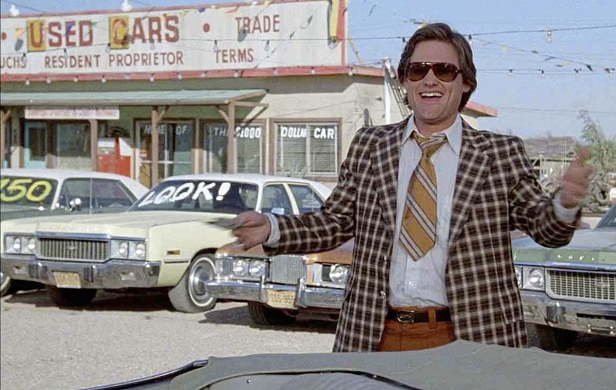

# What drives the price of a car?

**OVERVIEW**

In this application, we will explore a dataset from kaggle. The original dataset contained information on 3 million used cars. The provided dataset contains information on 426K cars to ensure speed of processing.  The goal is to understand what factors make a car more or less expensive.  As a result of this analysis, wer'e going to provide clear recommendations to the client -- a used car dealership -- as to what consumers value in a used car.

To frame the task, throughout this practical applications we will refer back to a standard process in industry for data projects called CRISP-DM. This process provides a framework for working through a data problem. 
Next sections will show the CRISP-DM Steps applied to mentioned topic

### Business Understanding
In order to be able to identify and understand what are the key drivers for used car prices, we are going to work on the data of used car business which was previously collected and provided to us by a dataset (CVS Format). We are going to apply the data analysis techniques for getting the knowledge about the data atttributes and use the Machine Learning tools for the processing of the data.
The dataset contains different attributes of the sale of used cars like: the price, the location, color and engine features and many others.

### Data Understanding
1. Explore the dataset attributes to know about the data types
2. Plot the data to see their distribution
3. Identify missing data:
  - What attributes don't contain data.
  - Determine the amount of records per attribute with that condition.
  - Define how to deal with missing values: drop the records, replace the value, drop the column
4. Detect and remove the outliers for price attribute
5. Identify what are the categorical and ordinal features:
  - Identity unique values per attribute.
  - Apply the proper encoder so they can be used in the regression model.
6. Identify what attributes are not needed and remove them from dataset
7. Run the correlation to the target so we can identify what features have a strong positive correlation.

### Data Preparation
See the [prompt_II.ipynb](https://github.com/DiegoHermosa/UsedCarPrices/blob/main/prompt_II.ipynb) jupyter notebook, there in the section Data Preparation, the data was reviewed and cleaned, next is a summary of what it was done:

1. Missing data: the vehicles dataset had some features with missing data which was cleaned
   
2. Price outliers: the price outliers were removed getting a more distributed price data
   
3. Categorical features: the categorical features were identified, their values were adjusted and them we encoded them by TargetEncoder tool.
4. Initial correlation data with Price: we ran the correlation founding the initial features having impact on the Price.
   

### Modeling
Once we got the data ready, then we built and ran a number of different regression models with the price as the target,  this with the aim to identify the best model
and a list of the top feature which drive the used car prices, the next list shows the models ordered by the performance scores:

- The Simple Cross Val + Linear Regression and Grid Search + Ridge got the best MSE and R2 scores,the next list shows the results.
- According to that, we ran the Permutation importances for both of the models.
- The Permutation importances found that year, model, condition, cylinders and odometer are the top five of features which have impact on the price: year, model, condition, cylinders and odometer.
- Some of these features were also in the coefficients of the models too.
- Because we used TargetEnconder to deal with the categorical features avoiding the high multidimensionality, we did a further analysis for getting more details, for example: what are the especific models getting the better prices.

### Analysis of each one of the top features
#### Grouping the price by bins: low, medium and high

#### Grouping the car year by bins

#### Year
1. Review how the car years are distributed by the Price Categories

- This plot show us how the car year impact on the price, the newest cars got the higher prices but it's important to note the high price group has fewer cars(2.3 %) than low (24.3%) and medium (73.4%) price groups

2. Let's eview how the prices are distributed by year categories

- This plot show us that Recent and Most Recent cars groups have less than 19% % of the total vehicles, their prices are mostly medium with some outliers in the low and high price categories

#### Model
1. Distribution of models by Price Categories

- Most of the models have a low price
- There are some models which have the medium and high prices

2. Distributtion of models by Year Categories

- Most of the models have old cars

#### Odometer
1. Let's see how the odometer is distributed by bins

2. Price Distribution by Car Odometer Categories

- The correlation showed us Odometer has a negative correlation with price, this plot show us the better prices are for vehicles with lower odometer and vice-versa, alhought there are some exceptions indicanting the price depends on other features too.

#### Condtion
1. Proportion Used Cars by Condition

2. Distribution of Condition by Price Categories

- Used cars in good conditions have the better prices, most of the used cars have good condition

#### Cylinders
1. Proportion Used Cars by Cylinders
   

2. Distribution of Cylinders by Price Categories

- Used cars with 6 and 8 cylinders have the better prices
- Most of the used cars have 6 and 8 cylinders

### Conclusions
After analysing the provided data and applying the Machine Learning tools for price prediction we found there are top five car features which have a clear impact on the price. 
Each Car Dealer can use these features to tune their car inventory for getting better sales and profit, so depending on their target customers:
1. Some car dealers could be interested in Higher prices only, so they might reduce their inventory with recognized brand, in good condition, most recent models, and low odometer.
2. Some car dealers could be interested in the Medium Prices and Lower prices and rapid sales, so they might increase their inventory with more used cars which be slighty older cars , in not so good conditions and average and high odometer

Next is the list of features and aspcted used in the analysis:

#### Price Categories (US$):
1. Low:     201    to 26800
2. Medium:	26814  to 53337 
3. High: 	53414  to 79999

#### Year Categories:
1. Older:           1900 to	2011
2. Slightly Older:	2012 to	2017
3. Recent:	        2018 to	2019
4. Most Recent:	    2020 to	2022

#### Car Features:
 #### Year:
- Most Recent (0-3 years old): These are late-model cars with the latest features and technologies. They typically command higher prices due to their near-new condition.
- Recent (3-5 years old): Still considered very relevant and well-equipped, these cars offer a good balance between features, price, and depreciation.
- Slightly Older Used Cars (5-10 years old): These become more affordable options while still offering modern features and reliability. They might be a good choice for budget-conscious buyers.
- Older: more than 10 years, in general these cars have the lower prices but there are exceptions, old cars in good condition, low odometer and with a well recognized Brand-Model could have higher prices.

#### Model
There are some models having medium and high prices: Chevrolet-Silverado,  Toyota-Tundra,  Ford-F-150,  Toyota-Tacoma,  Chevrolet-Corvette,  Jeep-Wrangler, Chevrolet-Camaro,  Ford-Ranger,  Ford-F150,  Ram-1500,  Ford-F250. As you can see all of them belongs to recognized Manufactures. It's importante to note the good price is related to other features.

#### Condition
The condition is a  key feature to get higher prices, the 'Good' condition has the higher prices, therefore this feature has big impact on the other features.

#### Cylinders
- Used cars with 6 and 8 cylinders have the better prices
- Most of the used cars have 6 and 8 cylinders

#### Odometer
Along with the condition, the Odometer has also a big impact on the price. Used cars with low odometer have the higher prices, next are the categories we used to analyze the price

- Low Mileage (Under 30,000 miles): These cars are considered lightly used and likely have minimal wear and tear. They might be
  well-maintained and command a premium price due to their near-new condition. Ideal for buyers seeking a car with minimal prior usage.
- Average Mileage (30,000 - 75,000 miles): This falls within the typical range for used cars and suggests moderate use. These cars are
  likely to have undergone routine maintenance and are a good balance between affordability and condition. They are a popular option for
  many used car buyers.
- High Mileage (75,000 - 100,000 miles): Cars in this range have seen more use, and potential buyers should be more attentive to
  maintenance history and overall condition. Depending on the car's age and how well it was maintained, it could still be a reliable
  option. These cars tend to be more affordable than lower mileage counterparts.
- Very High Mileage (Over 100,000 miles): Cars with extremely high mileage have significant wear and tear and might require more frequent
  repairs. Their value is considerably lower than cars in other categories. Buyers should carefully inspect these cars and consider their
  budget for potential maintenance needs.

### Next Steps
1. Add new models with more advanced algorithms   
2. Add new plots doing more crossings between features to get more insigths about the used car prices behavior. 

